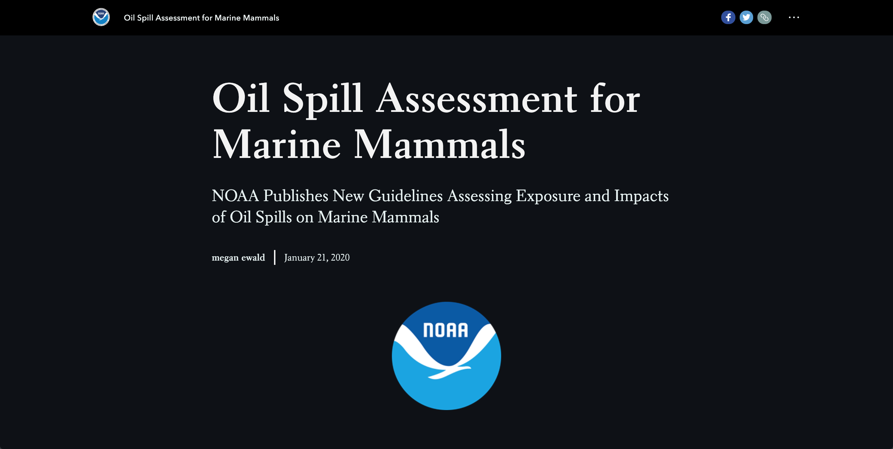
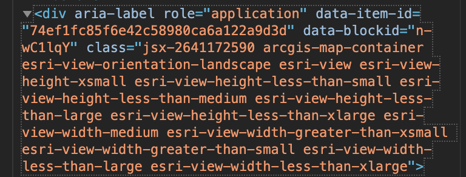
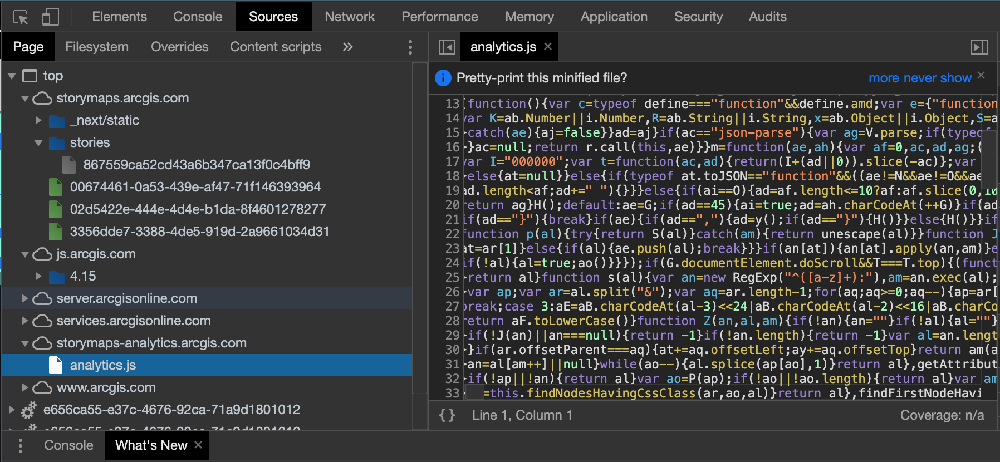
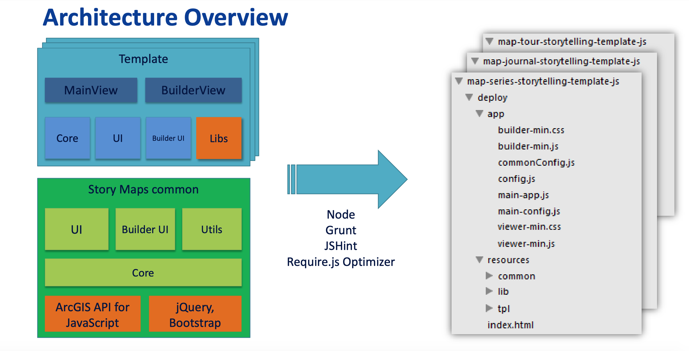
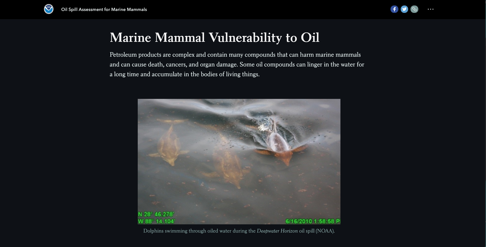
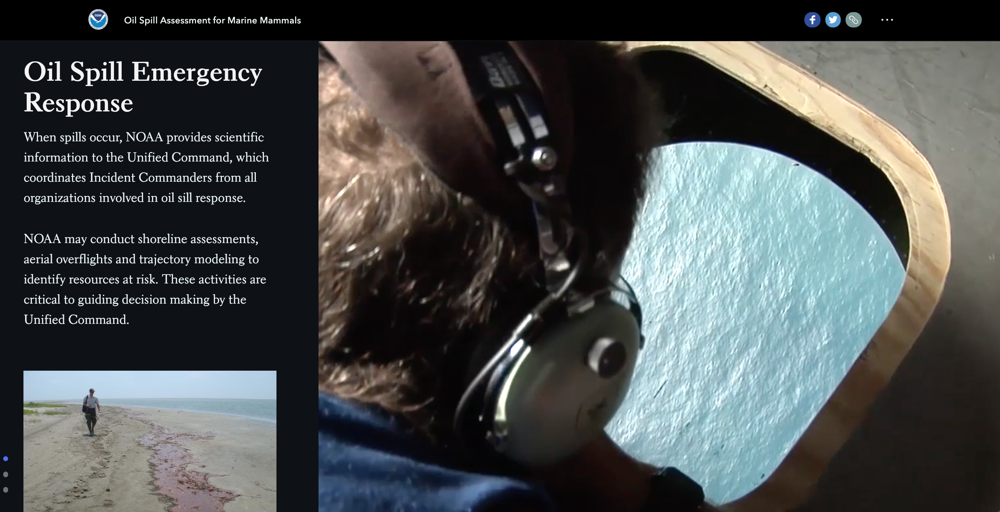
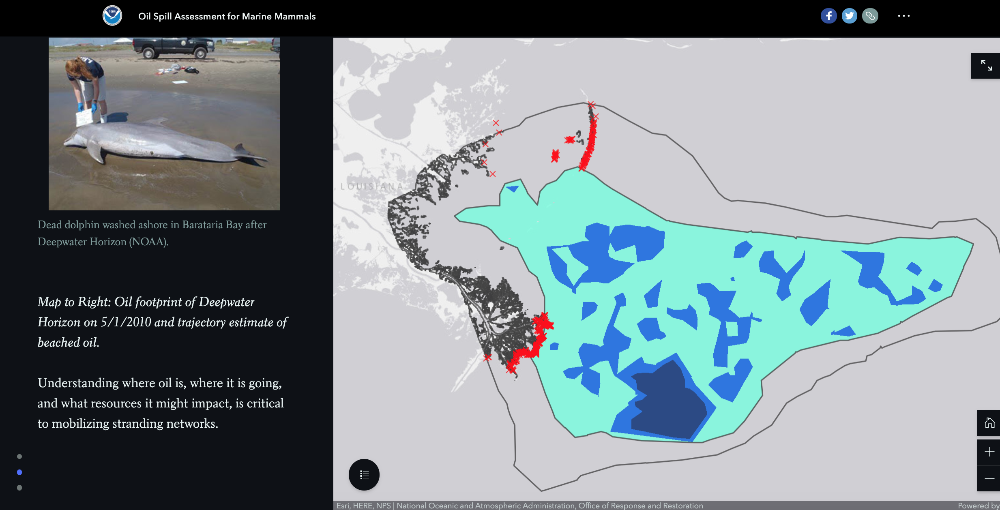
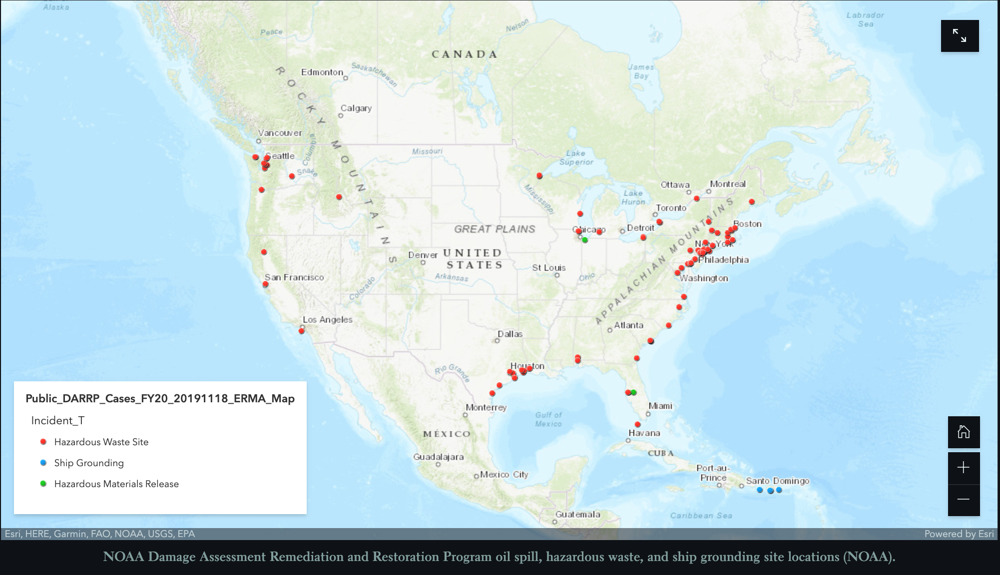
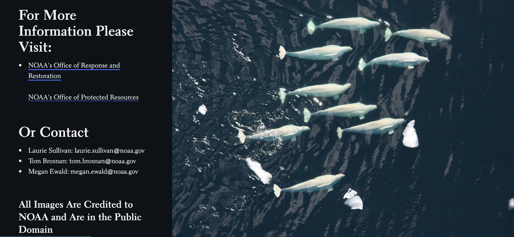

**Tyler Treat**
**Geog 458**

#Story Map Essay Analysis


###An analysis on NOAA's Story Map of *Oil Spill Assessment for Marine Mammals*

As I come to the end of my college career and graduate with a degree in the Geography I find myself thinking about what I hope to do with the skills I have gained. I have found that I really enjoy mapping and working with water and marine environments so I chose this [story map](https://storymaps.arcgis.com/stories/867559ca52cd43a6b347ca13f0c4bff9) as it is something I could potentially see myself creating in the future.

###Project Purpose, Goal, and Audience.



The goals/purpose of this story map are as follows:

- Provide an overview of some of the information, tools, and figures found in the report ["Guidelines for Assessing Exposure and Impacts of Oil Spills on Marine Mammals"](https://repository.library.noaa.gov/view/noaa/22425).
- Set up information in way that is easy for people of all backgrounds and knowledge level to comprehend.
- Spread awareness of the problem of oil spills and its impacts on marine life.

It is also important to note the the authors of this story map are three marine biologist, Laurie Sullivan, Tom Bronsan, and Megan Ewald. Two of which have GIS skillsets which were used to create this map. The data that they used were all opensourced and pulled directly from NOAA's public domain.

###Story Map Main Sections

When going through the story map, the **first section** provides readers with an interactive map that shows the locations of oil spills around the U.S. and Puerto Rico.

In terms of functionality this maps does infact do what it states in it's title. It provides current oil spill locations (as of January, 21 2020). The major functions of this map is the points/marker pop ups that provide the name of the case and location of the spill. However I will say that they could have possibly include more information in the pop up such as the exact location and how much oil was recorded to have spilled. It has a small legend icon in the bottom left corner that allows the users to pan over it and see the meaning behind the icon. I personally believe that this map already provides plenty of space for a legend to be shown without needing to scroll over it as it is a bit difficult to notice. The map also contains the function of zooming in and out which is always helpful as well as a full screen option. The base map use for this is topographic but only for the water and the major oceans and seas which makes sense considering this was created by NOAA.

The following is the code was used to help generate this map into the story map.


followed by
```
<div class="esri-ui-inner-container esri-ui-corner-container" style="top: 15px; bottom: 30px; left: 15px; right: 15px;">
<div class="esri-ui-top-left esri-ui-corner"></div><div class="esri-ui-top-right esri-ui-corner"></div>
<div class="esri-ui-bottom-left esri-ui-corner"></div><div class="esri-ui-bottom-right esri-ui-corner">
<div class="esri-component esri-home esri-widget--button esri-widget" role="button" tabindex="0" aria-label="Default map view" title="Default map view">
<span aria-hidden="true" class="esri-icon esri-icon-home"></span><span class="esri-icon-font-fallback-text">Home</span></div>
<div class="esri-component esri-zoom esri-widget"><div class="esri-widget--button esri-widget esri-interactive" role="button" tabindex="0" title="Zoom in">
<span aria-hidden="true" role="presentation" class="esri-icon esri-icon-plus"></span><span class="esri-icon-font-fallback-text">Zoom in</span></div>
<div class="esri-widget--button esri-widget esri-interactive" role="button" tabindex="0" title="Zoom out">
<span aria-hidden="true" role="presentation" class="esri-icon esri-icon-minus"></span><span class="esri-icon-font-fallback-text">Zoom out</span>
</div>
</div>
</div>
</div>

<div class="esri-attribution__powered-by">Powered by <a class="esri-attribution__link esri-widget__anchor"
href="http://www.esri.com/" target="_blank" rel="noreferrer">Esri</a></div>

```
As you can see, this map uses alot of Esri properties that needed to be transfered in using an Esri plug in within th code. As Esri provides an application that allows and easy creation of story maps, these lines of code get created by the computer as the user adds to the story map maker application. These codes in particular focus on the maps placement and window as we can see in the first image when it pulls in "acrgis-map-container..." It is very clear that the libraries used to complete the code of this story map is CSS, HTML and uses WYSIWYG ("What You See Is What You Get") builder functions. It also utilizes jQuery, Bootstrap, and has no JavaScript framework so it applies an API from ArcMap that contains the JavaScript. Below shows the sources used with creating this and as you can see the majority comes from cloud based arcgisonline packages and files.




The code above is similar to the same code used to create two more maps seen later on.
Below is an image created by Esri themselves that show the architecture overview of generating a storymap just like this.



The following section, **section two** contains slides, videos and images pertaining to the impact of the oil spills, how they happen, and how might we solve these problems. They are set up in a scroll style interactive panel so while the user scrolls down the information on the page changes.




They even include a sidescroller that goes more indepth into the science behind oil and the impact that different level of exposure has to the marine environment and its inhabitants.
The overall appearance and interactivity of this particular section is very well done and put together. It runs very smoothly and fluidly goes through the topics nicely.

The next section, **section four**, which extends from the down scrolling panels gives the readers their next map on **Oil footprint of Deepwater Horizon on 5/1/2010 and trajectory estimate of beached oil.**



As stated by the authors:

> Understanding where oil is, where it is going, and what resources it might impact, is critical to mobilizing stranding networks.

By doing this, documenting the geographic extent of oil spills, scientists can also  identify overlap with places marine mammals are known to live.

They never state specifically why they decided to use the Deepwater Horizon oil spill, but from my understanding, this oil spill is still ranked as the *second worst oil spill in the history of the world*, just behind that of the The Persian Gulf War Oil Spill of 1991, and because it was a U.S company and its heavy impact on the Louisiana coast.
I would personally recommend that in the statement about "understanding where oil is.." they include a brief sentence on why they used this particular oil spill so the readers doesn't have to assume or guess.

As you can see in the image above, the map for the most part is relatively clear. They use an X icon to mark the sites and used clear polygons to show the different levels of oil spilage. I would say that there is a slight issue with the Xs being clumped together but luckily the zoom function allows users to overcome that. Overall, I would agree and say that the map is relatively effective in doing its pupose of sharing this data. As for the functionality of the map, it does take a little bit of time to load. It has the same affect as the first one where there is a zoom in/out and  a fullscreen button and the legend is hidden by an icon/button unless scrolled over or tapped on.

**Section five** is all about the Assessment Methods that is discussed in the report and is being used by real time marine biologiest and environmental conservationist. Similar **section two's** side sidescroller function, **section five** contains an 11 page scroller that goes through the different methods of assesment and the details about the reasons behind them. These methods are:

- Photo documentation: the most common form of data collection
- Capture-Release Health Assessment: Allows for hands on help with the animals and close research on the impacts of the oil with marine life. It even provides the opportunity for follow up check ups.
- Sampling of Oil: Measuring the amount of oil in the water, sand, plant life, and animals. Helps indicate levels of exposure.
- Visual Health Assessment: This is particularly used for large mammals, such as whales, who are to big for capture and release. These photos can be reviewed by experts to to evaluate skin condition, scarring, presence of calves, and body conditions of the said mammals.
- Sampling of Feces: By collecting fecel samples scientists can study the digestive systems of animals exposed to oil.
- Sampling of Breath: Similar to the sampling of feces, sampling of the breathe of marine mammals help determind the animals immune function.
- Necropsy: Studying the corpses of recently deceased animals allows scientists to collect a vast amount of data.
- Passive Acoustic Monitoring: scientists deploy a microphone in the water to listen to see is there are any animals in the water at a specific area.
- Remote Biopsy: Scientist will use a spear like tool to collect some blubber or skin, in order to test later in a lab and even tag the animal for further check ups.


**Section six** instroduces readers to their final map.



This map shows the locations of different sites of the **Damage ASsessment Remediation and Resoration Program** along with category of site it is and or what is being done at said site.

The map is not only very clear, but it allows user to click on a marker and it opens a pop up containing all the location data from lat and long to county and state, and so forth, as well as the site name, ID, and the specific activity happening on said sit. The functionality follows along to the pattern of the previous two maps provided and contain the same feature such as the legend, zoom, and full screen.

**Section 7** Wraps up the end of the story element of the story map by providing readers with a side scroller pertaining to the different laws protecting marine mammals and oil spills. This allows readers who want to learn more about how they can help to get involved and be more informed when they see something that is questioning.

The tail end of the story map contains all the contact information for the authors of the story map and links to other resources that can be useful to readers who are interested in learning more. It also contains the 'credited' information alerting readers that all the information and images are from NOAA but can be found in the public Domain.




Overall, I think this was a great storymap. While the maps did support a responsive design, but because the purpose of this storymap was to be simple enough for most to undestand they didn't need it to be particularly 'fancy'. Knowing that I think their choice on the maps was pretty good. However, I do wish they included just a bit more information within the pop ups, or even added a map that references sighted animals in oil spill locations in order to provide a bigger impact at just how many animals can be affected by an oil spill. I also noticed that there was no North Arrows or scale bars which was strange and I would personally want to add. The UI/UX was simple but elegent on all part of this storymap. It included a balanced integration of images and videos as well as the maps, an it was interactive enough with the scrolling and maps to keep the users interested in reading compared to a single page scroller. The section organization made sense and was set up in a manner that effectively tells the story of oils spills and marine mammals.

This story map overall brings alot of awareness to the issues and heavy impacts that oil spills have on the marine environment, but I couldn't help noticing while going over this map just how easy it would be to adjust this to tell the story of oil companies and sea faring communities. Oil spills have major impacts on the towns and cities located on the coast, particularly for ones who thrive from the fishing industry (oils spills effect normal marine life just as much as marine mammals) and have caused a lot of stress between major oil companies and these communities. By adjusting the topics slightly, and the fact that the story maps already contain a map showing how they predict where the oil spills are going, these kinds of maps can help alert the towns and cities as who they should look to for help and who can alert them to potential oil spillages. These communities can then inturn help with the restoration efforts and become more informed with the laws pertaining to oil spills and marine protection. By being more informed these communities have a better fighting stance against the companies that have brought harm to their area and coast.

**Sources:**
https://storymaps.arcgis.com/stories/867559ca52cd43a6b347ca13f0c4bff9
